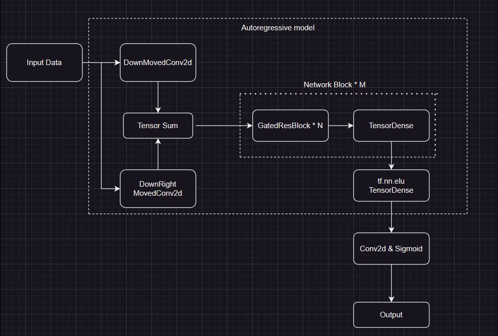
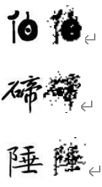

# ml_autoregressive_model

# Introducton

An convolutional neural network (CNN) based autoregressive model for image generation on a calligraphy dataset.

# Model overview

1. Causal convolution will be performed on training images.
2. The convoluted images enter network blocks which contain Resnet networks and TenserDense layers.
3. Images pass though a tf.nn.elu activation function.
4. Images pass though a CNN layer and a Sigmoid function.

# Evaluation

Binary cross entropy loss against test set:\
Before loading weight: 0.6972017288208008\
After loading weight: 0.202795147895813\
After fitting: 0.19266654551029205

Accuracy: 0.9200

# Demonstration with Chinese calligrahy inputs

